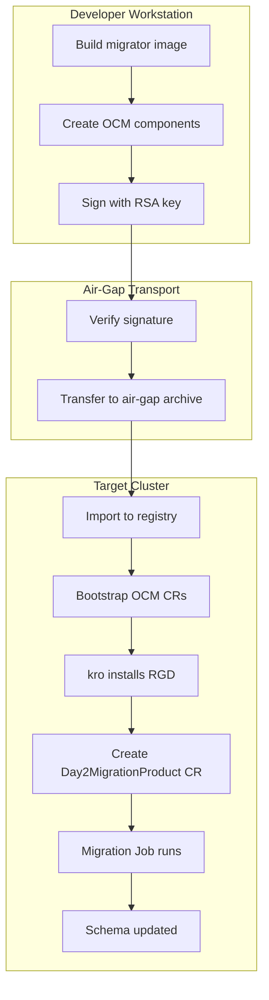
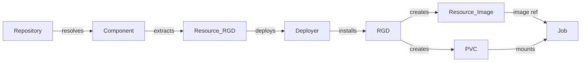

# Day-2 Migration Scenario

Demonstrates database schema migrations delivered as OCM component artifacts, executed
by Kubernetes Jobs orchestrated by kro - no application code, just a database and
migration scripts traveling through the full OCM delivery pipeline.

## Overview

This scenario validates that OCM can deliver **operational artifacts** (not just application
binaries) through the complete lifecycle: build, sign, air-gap transport, deploy, and upgrade.

The "product" is a SQLite database that receives schema migrations via a dedicated container
image. Each component version carries the migration scripts as a first-class resource, and
upgrading the version triggers a new migration Job automatically.

Related: [ADR-0015: Sovereign Cloud Reference Scenario](../../../docs/adr/0015_sovereign_cloud_reference_scenario.md)

## Architecture

### Component Model

```
acme.org/day2/product (meta-component)
+-- componentRef: db-migrator --> acme.org/day2/db-migrator
|   +-- image (ociImage: alpine + sqlite3 + migration .sql files)
+-- product-rgd (blob: ResourceGraphDefinition)
```

### Deployment Pipeline



### Controller Reconciliation Chain



### Upgrade Mechanism

The migration Job name includes the version: `day2-migration-{version}`. When the
`Day2MigrationProduct` CR's `spec.version` changes:

1. kro re-evaluates CEL expressions, producing a new Job name
2. New Job is created (references updated migrator image)
3. Old Job is pruned by kro's ApplySet mechanism
4. Migrator container runs all migrations, skipping already-applied ones

## Quick Start

```bash
task run        # Full pipeline: cluster + build + deploy + verify
task upgrade    # Upgrade to v1.1.0 and verify schema change
task clean      # Tear down everything
```

See [USAGE.md](USAGE.md) for detailed step-by-step instructions.

## What This Validates

- Component version carries migration scripts as signed OCI artifacts
- Air-gap transport preserves migration artifacts through the delivery boundary
- kro orchestrates Job creation with correct ordering (PVC before Job)
- Version-in-name pattern handles Kubernetes Job immutability
- Idempotent migrations work for both fresh deploy and upgrade scenarios
- Schema evolution (ALTER TABLE) completes before reporting success
- OCM signature verification prevents tampered migration delivery

## Directory Structure

```
day-2-migration/
+-- README.md                          # This file
+-- USAGE.md                           # Detailed usage instructions
+-- Taskfile.yml                       # Build/deploy/verify automation
+-- components/
|   +-- db-migrator/                   # Migration container component
|   |   +-- component-constructor.yaml
|   |   +-- Dockerfile
|   |   +-- scripts/migrate.sh
|   |   +-- migrations/
|   |       +-- v1/                    # v1.0.0 migration set
|   |       +-- v2/                    # v1.1.0 migration set (superset of v1)
|   +-- product/                       # Meta-component (orchestrator)
|       +-- component-constructor.yaml
|       +-- config/
|       |   +-- sign.yaml
|       |   +-- verify.yaml
|       +-- deploy/
|           +-- rgd.yaml               # ResourceGraphDefinition
+-- deploy/
    +-- namespace.yaml
    +-- rbac.yaml
    +-- bootstrap.yaml                 # OCM CR chain
    +-- sample-product-1.0.0.yaml      # Initial deployment
    +-- sample-product-1.1.0.yaml      # Upgrade target
```

## Success Criteria

1. `task run` completes without errors on a fresh kind cluster
2. Migration Job `day2-migration-1-0-0` succeeds and creates the `items` table
3. `task upgrade` triggers migration Job `day2-migration-1-1-0`
4. v1.1.0 migration adds `category` column to existing `items` table
5. v1.1.0 migrator correctly skips already-applied migration 001
6. All components are signed and verified through the air-gap boundary

## Integration Points

This scenario serves as a conformance test for:

- **OCM Kubernetes Controller**: Component/Resource resolution, signature verification
- **kro**: Job orchestration, version-in-name lifecycle, ApplySet pruning
- **OCM CLI**: Component construction, signing, transfer, air-gap transport
